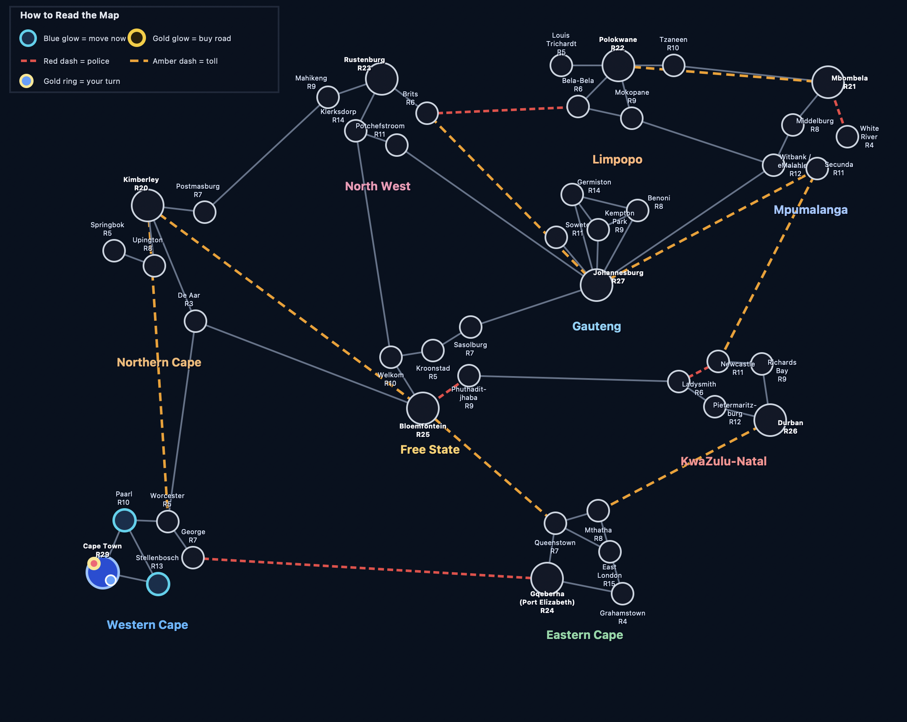
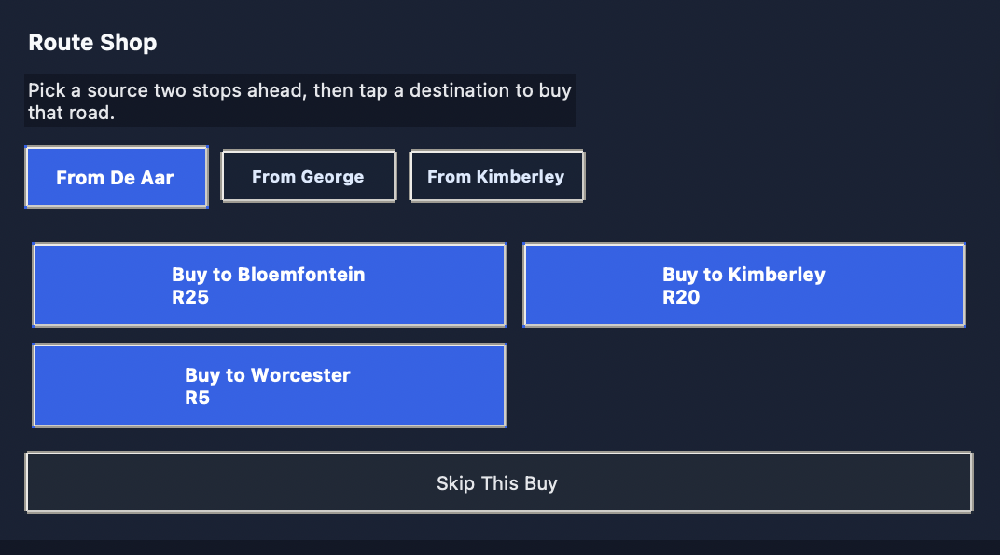
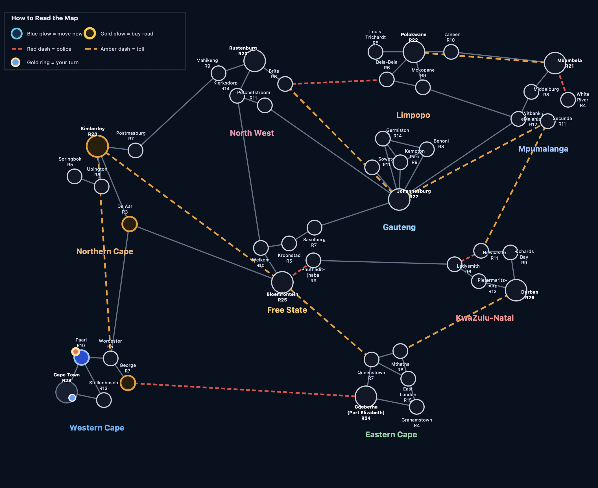
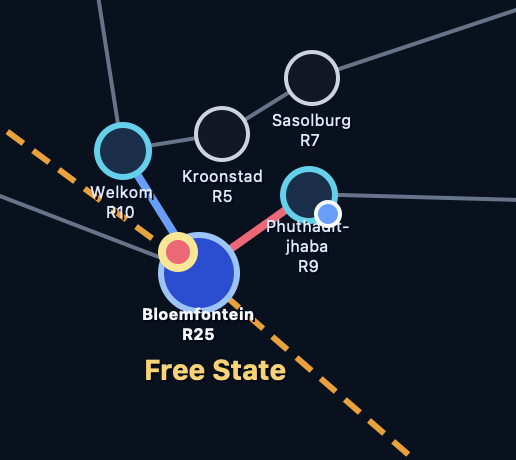
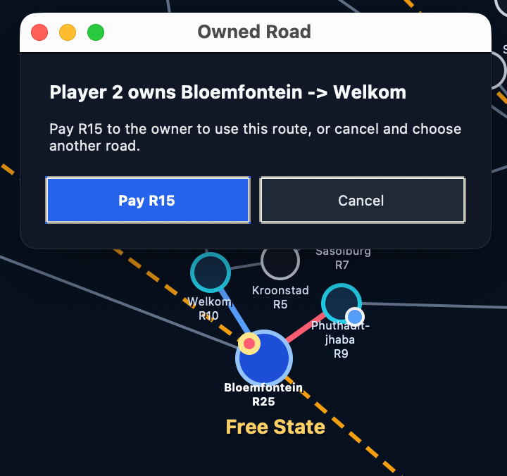
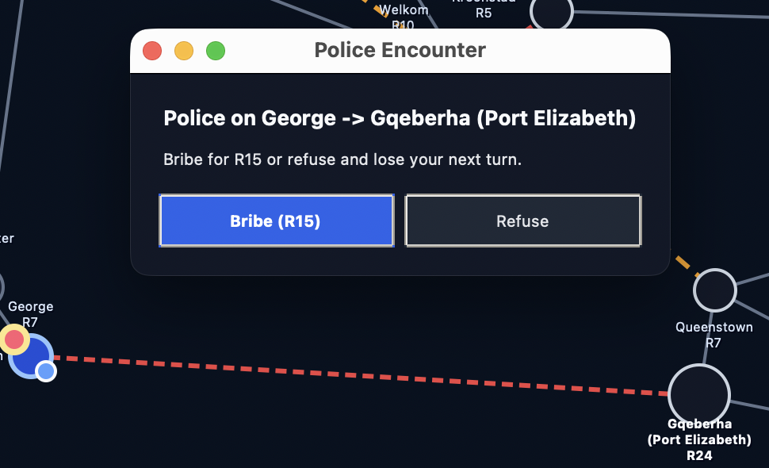
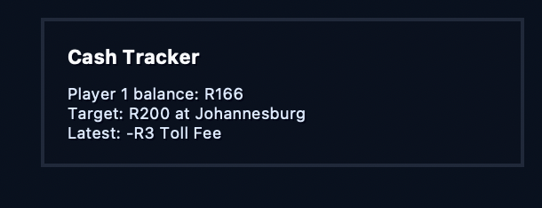
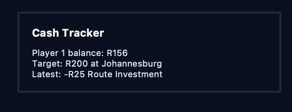
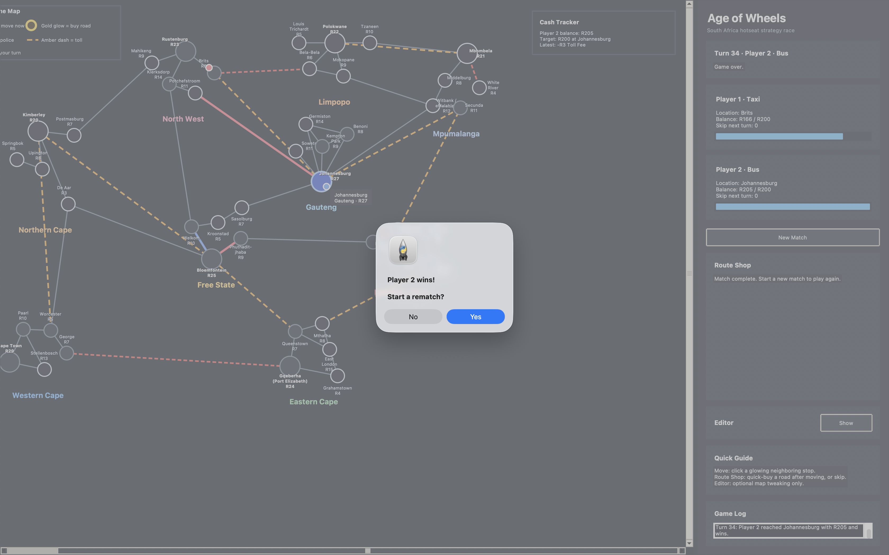

# Siyaya-Game

# Age of Wheels: South Africa Edition 

A South African-inspired spin on the classic *Age of Wheels* board game — featuring taxis, buses, toll gates, police roadblocks, route investments, and strategic travel across the country.

Travel the map, build wealth, sabotage your opponent’s movement, and become the first player to reach **R200**.

---------------------------------------------------------------------------------------------

## Game Overview
---------------------------------------------------------------------------------------------
Two players compete to earn money by traveling between towns and cities across South Africa.

* 🔵 **Blue Player** = Taxi
* 🔴 **Red Player** = Bus

Each player starts with **R120** and must strategically navigate the map while managing:

* Toll fees
* Police routes
* Investments
* Route ownership
* Risk vs reward

The first player to accumulate **R200** AND reach Johannesburg wins the game.

------------------------------------------------------------------------------------------------

## Core Mechanics
---------------------------------------------------------------------------------------------

### $ Earn Money

Travel through towns and cities to earn cash.

However:

* Major cities charge expensive toll fees.
* Some routes contain police checkpoints that may force you to:

  * Pay a bribe
  * Or lose your next turn

---

### $$ Invest in Routes

At the end of each round, players can invest in routes.

If your opponent travels through a route you own, they must pay you to pass.

This creates a strategic layer where players can:

* Block key movement paths
* Create expensive shortcuts
* Force opponents into risky routes

---

### Strategy Matters

Winning is not just about movement.

Players must balance:

* Safe vs risky routes
* Spending vs saving
* Expansion vs defense
* Toll costs vs profit opportunities

Every movement decision matters.

---------------------------------------------------------------------------------------------

## Gameplay visuals
---------------------------------------------------------------------------------------------

### 🗺️ Main Map

<p align="center">
  
  <br>
  <em>Main gameplay map showing cities, towns, routes, and player positions.</em>
</p>


---

### 💰 Investment System

<p align="center">
  
  <br>
  <em>Players may purchase and invest in routes to generate additional income.</em>
</p>

<br>

<table align="center">
  <tr>
    <td align="center">
      
      <br>
      <em>All cities and towns that can be invested in.</em>
    </td>
  
</table>

<br>

<p align="center">
  
  <br>
  <em>Successfully purchased route now generates revenue for the owner.</em>
</p>

<br>

<p align="center">
  
  <br>
  <em>
    The Taxi player attempts to use a route already owned by the Bus player.
  </em>
</p>


---

### 🚓 Toll / Police Events

<p align="center">
  
  <br>
  <em>
    The Bus player may either pay a bribe or refuse and forfeit the next turn.
  </em>
</p>

<br>

<table align="center">
  <tr>
    <td align="center">
      
      <br>
      <em>Player enters a tolled route.</em>
    </td>
    <td align="center">
      
      <br>
      <em>Investment amount deducted from player balance.</em>
    </td>
  </tr>
</table>


---

### 🏆 Winning Screen

<p align="center">
  
  <br>
  <em>
    The Taxi player accumulates R200 and reaches Johannesburg first, winning the game.
  </em>
</p>

---------------------------------------------------------------------------------------------

## Requirements to play
---------------------------------------------------------------------------------------------

The game is built using:

* Python 3
* Tkinter

To run the game, you only need:

* Python 3 installed
* VS Code or any Python-compatible IDE/environment

---------------------------------------------------------------------------------------------

## Running the Game
---------------------------------------------------------------------------------------------

Clone the repository and run:

```bash
python age_of_wheels.py
```

---------------------------------------------------------------------------------------------

## Current Development
---------------------------------------------------------------------------------------------

The project is currently being expanded with:

* Reinforcement Learning (RL)
* AI self-play training
* Strategy learning agents

The goal is to train agents that can:

* Compete against themselves
* Learn optimal travel and investment strategies
* Adapt to different player behaviors over time

---

## Inspired By

Inspired by the original *Age of Wheels* board game, reimagined with stronger South African themes and mechanics.

---

## Let the games begin.

